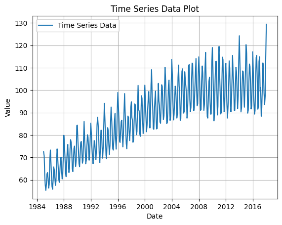

# Ex.No: 01 PLOT A TIME SERIES DATA
###  Date: 

# AIM:
To Develop a python program to Plot a time series data (population/ market price of a commodity
/temperature.
# ALGORITHM:
1. Import the required packages like pandas and matplot
2. Read the dataset using the pandas
3. Calculate the mean for the respective column.
4. Plot the data according to need and can be altered monthly, or yearly.
5. Display the graph.
# PROGRAM:

# OUTPUT:
]

# RESULT:
Thus we have created the python code for plotting the time series of given data.
